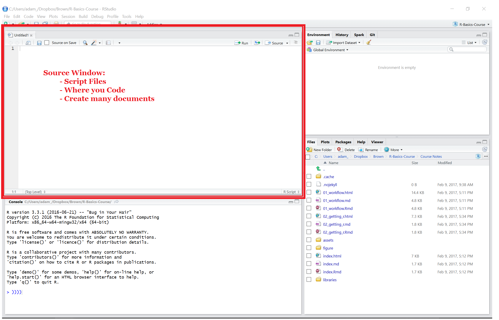
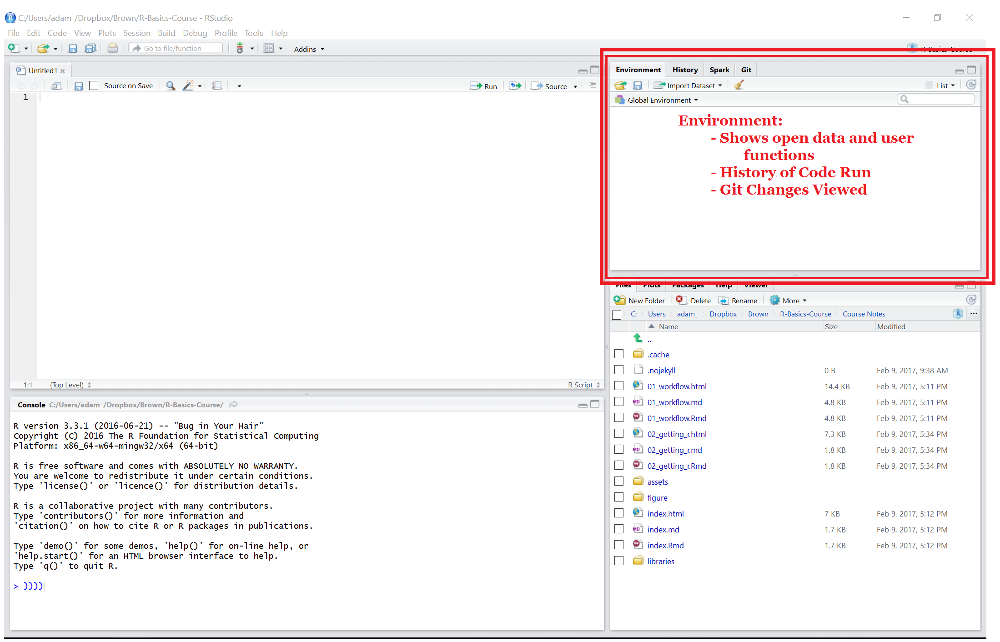
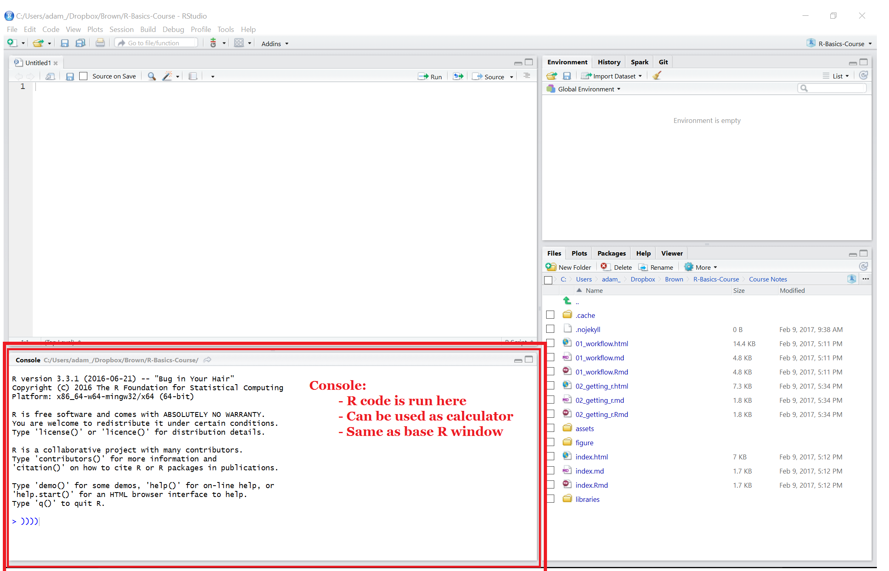

---
title       : Intro to R Programming for Biostatistics
subtitle    : "Day 1 - Getting Started with R"
author      : Adam J Sullivan
job         : 
license     : by-nc-nd
framework   : io2012        # {io2012, html5slides, shower, dzslides, ...}
highlighter : highlight.js  # {highlight.js, prettify, highlight}
hitheme     : tomorrow      # 
widgets     : [mathjax, quiz, bootstrap, interactive]            # {mathjax, quiz, bootstrap}
mode        : selfcontained # {standalone, draft}
logo        : shield_image.png
biglogo     : shield_image_large.png
knit        : slidify::knit2slides
assets      : {assets: ../../assets}
---  .segue bg:grey

# Ways to Use R

--- .class #id

## Base R


<center>

</center>


--- .class #id

## RStudio


<center>

</center>

--- .class #id


## RStudio


<center>

</center>

--- .class #id
 
## RStudio


<center>

</center>


--- .class #id
 
## RStudio


<center>

</center>


--- .class #id
 
## RStudio


<center>

</center>


---  .segue bg:grey

# Using R as a Calculator


---  .class #id


## Arithmetic Operators

Operator        |   Description
--------------- | --------------------
`+`             |    Addition 
`-`             |   Subtraction
`*`             |    Multiplication
`/`             |    Division
^ or `**`       |    Exponentiation

---  .class #id

## R as a Calculator

The most simple procedures that we can do in R is using R as a calculator. For example:


```r
# Addition
5+4
```

```
## [1] 9
```

```r
# Subtraction
124 - 26.82 
```

```
## [1] 97.18
```

---  .class #id

## R as a Calculator


```r
# Multiplication
5*4
```

```
## [1] 20
```

```r
# Division
35/8
```

```
## [1] 4.375
```

---  .class #id

## More Math in R

R works simply as a calculator but also can be used for more advanced operations as well. 


```r
# Exponentials
3^(1/2)
```

```
## [1] 1.732051
```

```r
# Exponential Function
exp(1.5)
```

```
## [1] 4.481689
```

---  .class #id

## More Math in R


```r
# Log base e
log(4.481689)
```

```
## [1] 1.5
```

```r
# Log base 10
log10(1000)
```

```
## [1] 3
```

---  .class #id

## Logical Operators

Once we have used some basic arithmetic operators we move into logic. 


 Operator  |  Description
---------- | ------------------------------
  `<`      |  Less Than
  `>`      |    Greater Than
  `<=`     |   Less Than or Equal To
  `>=`     |    Greater Than or Equal To
 `==`     |  Exactly Equal To
 `!=`      |   Not Equal To
 `!a`      |  Not `a`
 `a&b`    |  `a` **AND** `b`


--- .class #id

## Logic in R Example 

We can then see an example of this:


```r
a <- c(1:12)
# a>9 OR a<4
# Gives us 1 2 3 10 11 12

#Having R do this
a
```

```
##  [1]  1  2  3  4  5  6  7  8  9 10 11 12
```

```r
a>9
```

```
##  [1] FALSE FALSE FALSE FALSE FALSE FALSE FALSE FALSE FALSE  TRUE  TRUE
## [12]  TRUE
```

--- .class #id

## Logic in R Example


```r
a<4
```

```
##  [1]  TRUE  TRUE  TRUE FALSE FALSE FALSE FALSE FALSE FALSE FALSE FALSE
## [12] FALSE
```

```r
a>9 | a<4
```

```
##  [1]  TRUE  TRUE  TRUE FALSE FALSE FALSE FALSE FALSE FALSE  TRUE  TRUE
## [12]  TRUE
```

```r
a[a>9 | a<4]
```

```
## [1]  1  2  3 10 11 12
```

--- .class #id

## Further Operators

Some other operators we may want to use are listed below


Description                |  R Symbol  |    Example
-------------------------- | ---------- | -----------------------
 Comment                  |    #        |  \# This is a comment
 Assignment               |     `<-`       |   x `<-` 5
 Assignment                |    `->`       |  5 `->` x
 Assignment                |    `=`        |  x `=` 5
 Concatenation operator    |  c          |  c(1,2,4)
 Modular                  |    \%\%     |      25 \%\% 6
 Sequence from a to b by h |   seq       |   seq(a,b,h)
 Sequence Operator          |    :      |     0:3

--- .class #id

## Math Functions in R

We also have access to a wide variety of mathematical functions that are already built into R. 

  Description               |    R Symbol
--------------------------- | ------------------
Square Root                 |    `sqrt`
`floor(x)`                 |    `floor` 
`\ceil(x)`                |   `ceiling`
Logarithm                   |    `log`
Exponential function, `e^x`  |   `exp`
Factorial, `!`                |  `factorial`

---  .segue bg:grey

# Getting Help in R


--- class $id

## The `help()` Function

- To get online help within an R session we use the `help()` function. 
- For example if we want to create a sequence and know that we can use the function `seq()` but are unsure of the arguments


--- class $id

## Help Function Example


```r
# help() function with seq as argument
help(seq)

# Shortcut for help() is ?
?seq
```

--- class $id

## Further Help Funcion Use

We can also get help on characters and words by placing them in quotations


```r
#Special characters < (all of these display the same information)
help("<")
help('<')
?"<"
?'<'

# Help for words (same use of quotations above work
?"for"
```

--- class $id

## The `example()` Function

- Many times we just need to see some examples rather than read the entire documentation of a function or command.
- In this situation we would use the `example()` function


```r
example(seq)
```

--- class $id

## The `example()` Function

- We can then see numerous examples that R has run for us. 
- The benefit of this command comes when you are interested in seeing examples of graphics, where just seeing the command and not the final product may not be as intuitive for us


```r
#Example of Perspective Plots
example(persp)
```

--- class $id


## The `help.search()` Function

The other help items are great if you know what function you are looking for. Many times we do not know exactly what we are looking for and need to do a more comprehensive search to find a proper function. 


```r
#Search for information about normal
help.search("normal")
```


---  .segue bg:grey

# Importing Data into R

--- .class #id

## Ways to get Data into R?

We use

- Built in Data
- .csv, .txt. .xls, ....
- SPSS, SAS, Stata
- Web Scraping
- Databases


--- .class #id

## Built in Data

- R has a wealth of data built in.
- We can use `data()` function to find it


--- .class #id

## Built in Data

- List all Datasets

```r
data()
```
- Specific packages data

```r
data(package="tidyr")
```


--- .class #id

## Delimited Files

- There are many packages out there which handle all of these things. 
- We will stick to using the tidyverse packages. 
- This will provide consistency with all we do. 

--- .class #id

## `readr` in Tidyverse

- `readr` is a collection of many functions
    - `read_csv()`: comma separated (CSV) files
    - `read_tsv()`: tab separated files
    - `read_delim()`: general delimited files
    - `read_fwf()`: fixed width files
    - `read_table()`: tabular files where columns are separated by white-space.
    - `read_log()`: web log files
- `readxl` reads in Excel files. 

--- .class#id

## Reading Delimited Files

- Many files are separated by delimiters. 
- Common Ones are
    - comma (`,`)
    - semi-colon (`;`)
    - tab (  or `\t` )
- We can use various functions to read these files in. 

--- .class#id

## Reading Delimited Files

- In the third session we will use the following functions in practice:
    - `read.csv()`
    - `read.delim()`

--- .class #id

## Importing From Other Software

- R can read files from many other software types.
    - SAS
    - Stata
    - SPSS


--- .class #id

## Enter Haven Package

- `haven` is part of tidyverse.
- It contains the functions to read many different files.
- It can also write to those same data types. 

--- .class #id

## For SAS

```
read_sas(data_file, catalog_file = NULL, encoding = NULL)

write_sas(data, path)
```

--- .class #id

## For Stata

```
read_dta(file, encoding = NULL)

read_stata(file, encoding = NULL)

write_dta(data, path, version = 14)
```

--- .class #id

## For SPSS

```
read_sav(file, user_na = FALSE)

read_por(file, user_na = FALSE)

write_sav(data, path)

read_spss(file, user_na = FALSE)
```


---  .segue bg:grey

# Data Objects in R

--- .class #id

## Now That we Can Import Data


We begin with a look at different kinds of data

- **Booleans**: Direct binary values: `TRUE` or `FALSE` in R. 
- **Integers**: Whole numbers or number that can be written without fractional component, represented by a fixed-length block of bits.

--- .class #id

## Data Objects

- **Characters**: fixed length block of bits with special coding.
- **Strings**: Sequence of characters.
- **Floating Point Numbers**: a fraction times an exponent, like $1.34x10^7$, however in R you would see `1.34e7`. 
- **Missing**: `Na`, `NaN`, $\ldots$

--- .class #id

## Finding Type of Data

With types of data, R, has a built in way to help one determine the type that a certain piece of data is stored as. these consist of the following functions:


- **typeof()** this function returns the type
- **is.`typ`()** functions return Booleans for whether the argument is of the type ***typ***
- **as.`typ`()** functions try to change the argument to type ***typ***

--- .class #id

## Examples of Type


```r
typeof(7)
```

```
## [1] "double"
```

```r
is.numeric(7)
```

```
## [1] TRUE
```

--- .class #id


## Examples of Type


```r
is.na(7)
```

```
## [1] FALSE
```

```r
is.na(7/0)
```

```
## [1] FALSE
```

--- .class #id

## Examples of Type


```r
is.na(0/0)
```

```
## [1] TRUE
```

```r
7/0
```

```
## [1] Inf
```

```r
0/0
```

```
## [1] NaN
```

--- .class #id


## Examples of Type


```r
is.character(7)
```

```
## [1] FALSE
```

```r
is.character("7")
```

```
## [1] TRUE
```

--- .class #id

## Coercing Data Types


```r
as.character(5/6)
```

```
## [1] "0.833333333333333"
```

```r
as.numeric(as.character(5/6))
```

```
## [1] 0.8333333
```

--- .class #id

## Equality of Data


```r
6*as.numeric(as.character(5/6))
```

```
## [1] 5
```

```r
5/6 == as.numeric(as.character(5/6))
```

```
## [1] FALSE
```

--- .class #id

## What Happened?

>- What we can see happening here is a problem in the precision of what R has stored for a number. 
>- This can also occur when performing arithmetic operations on values as well.

--- .class #id

## A Closer Look


```r
5/6 - as.numeric(as.character(5/6))
```

```
## [1] 3.330669e-16
```


--- .class #id

## Further Tries at Equality


```r
0.45 == 3*0.15
```

```
## [1] FALSE
```

```r
0.45-3*0.15
```

```
## [1] 5.551115e-17
```

```r
0.4 - 0.1 == 0.5 - 0.2
```

```
## [1] FALSE
```

--- .class #id

## `all.equal()` Function

When comparing numbers that we have performed operations on it is better to use the `all.equal()` function.

--- .class #id

## Example


```r
all.equal(0.45, 3*0.15)
```

```
## [1] TRUE
```

```r
all.equal(0.4-0.1, 0.5-0.2)
```

```
## [1] TRUE
```

---  .segue bg:grey

# Vectors in R


--- .class #id

## What is a Vector?

- The fundamental data type in R is the vector. 
- A vector is a sequence of data elements of the same type. 
 


--- .class #id 

## Creating Vectors
 
What we have used here is the concatenation operator which takes the arguments and places them in a vector in the order in which they were entered. 


```r
 x <- c(1,5,2, 6)
 x
```

```
## [1] 1 5 2 6
```

```r
 is.vector(x)
```

```
## [1] TRUE
```
 

--- .class #id

##  Vector Arithmetic
 
- We can do arithmetic with vectors in a similar manner as we have with integers. 
- When we use operators we are doing something element by element or "elementwise." 
 

```r
 y <- c(1,6,4,8)
 x+y
```

```
## [1]  2 11  6 14
```


--- .class #id

## Elementwise

It is important to remember what happens when we consider an ``elementwise" operation
 

```r
 x*y
```

```
## [1]  1 30  8 48
```

```r
 x/y
```

```
## [1] 1.0000000 0.8333333 0.5000000 0.7500000
```

```r
x %% y
```

```
## [1] 0 5 2 6
```

--- .class #id
 
 
##  Recycling

- We do have to be careful when performing arithmetic operations on vectors. 
- There is a concept called recycling and this happens when 2 vectors do not have the same length

--- .class #id

## Recycling Example
 

```r
 z<- c(1,2 ,6 ,8, 9, 10)
 
 x+z
```

```
## Warning in x + z: longer object length is not a multiple of shorter object
## length
```

```
## [1]  2  7  8 14 10 15
```

--- .class #id

##  Recycling

- Intuition would make us think that we could not perform this operation when the length of both vectors are not the same. 
- However what R does is it rewrites `x` such that we have `x <- c(1 , 5, 2, 6 , 1, 5)`.
- This is called recycling, when R makes the shorter vector longer by repeating elements in the order they are listed in.

--- .class #id

## Recyling
 

```r
x+ z
```

```
## Warning in x + z: longer object length is not a multiple of shorter object
## length
```

```
## [1]  2  7  8 14 10 15
```

```r
c(1 , 5, 2, 6 , 1, 5) + z
```

```
## [1]  2  7  8 14 10 15
```


--- .class #id

##  Functions on Vectors
 
- There are various functions that we can run over a vector and as we continue on we will learn more about these functions.
 
- One of the simplest functions can help us with knowing information about Recycling that we encountered before. This is the `length()` function. 


--- .class #id

## Functions on Vectors


```r
length(x)
```

```
## [1] 4
```

```r
length(y)
```

```
## [1] 4
```

```r
length(z)
```

```
## [1] 6
```

--- .class #id

## Functions on Vectors


- Then length vector is very important with the writing of functions which we will get to in a later unit.  
 
- We can use ***any()*** and ***all()*** in order to answer logical questions about elements 


--- .class #id

## Functions on Vectors


```r
any(x>3)
```

```
## [1] TRUE
```

```r
all(x>3)
```

```
## [1] FALSE
```

--- .class #id

##  Built in Functions

 There area various other functions that can be run on vectors some you have seen in other classes.
 
- ***mean()*** finds the arithmetic mean of a vector. 
- ***median()*** finds the median of a vector.
- ***sd()*** and ***var()*** finds the standard deviation and variance of a vector respectively.

--- .class #id

##  Built in Functions

- ***min()*** and ***max()*** finds the minimum and maximum of a vector respectively.
- ***sort()*** returns a vector that is sorted. 
- ***summary()*** returns a 5 number summary of the numbers in a vector. 

--- .class #id

##  `which()` Function
 
- Some functions help us work with the data more to return values in which we are interested in. 
- For example, above we asked if any elements in vector `x` were greater than 3. 
- The `which()` function will tell us the elements that are. 
 

```r
 which(x>3)
```

```
## [1] 2 4
```

--- .class #id

##  Vector Indexing
 
We can call specific elements of a vector by using the following:
 

- `x[]` is a way to call up a specific element of a vector.
- `x[1]` is the first element.
- `x[3]` is the third element.
- `x[-3]` is a vector with everything but the third element. 

--- .class #id
 
##  Working with Vectors 
 

```r
 #List elements to make sure we have what we need
 ls()
```

```
## [1] "x" "y" "z"
```

```r
 x[3]
```

```
## [1] 2
```

```r
 x[-3]
```

```
## [1] 1 5 6
```

--- .class #id

## Replacing Values

- We have seen how to subtract an element from a vector but we can use the same information to place it back in. 
- We start with the same vector `x` that we started with. 
 

```r
 x
```

```
## [1] 1 5 2 6
```

```r
 x<-x[-3]
 x
```

```
## [1] 1 5 6
```

--- .class #id

## Insering Values

 We can then add the original element back in
 

```r
 x <- c(x[1:2], 2, x[3])
 x
```

```
## [1] 1 5 2 6
```

--- .class #id

##  Indexing with Booleans

- Before we used `any(x > 3)` and `which(x > 3)`. 
- Now we can see not only their position in the vector, but indexing allows us to return their values. 
 

```r
 x[x > 3]
```

```
## [1] 5 6
```

--- .class #id

##  Creating Vectors
 
 There are multiple ways we can create a vector but we must let R know what we are doing
 

```r
 y[1] <- 3
 y[2] <- 15
```

--- .class #id

##  Creating Vectors
 
 Within R, we have not defined any `y` yet so it will not create a vector in this manner. There are multiple ways of creating vectors:
 

```r
 y1 <- vector(length=2)
 y1[1] <- 3
 y1[2] <- 15
 
 y1
```

```
## [1]  3 15
```

--- .class #id

## Creating Vectors


```r
 y2 <-  c(3,15)
 y2
```

```
## [1]  3 15
```

```r
 y3 <- seq(from=3, to=15, length=2)
 y3
```

```
## [1]  3 15
```

```r
 y4 <- seq(from=3, to=15, by=12)
 y4
```

```
## [1]  3 15
```
 
--- .class #id

## Creating Vectors

 Aside from these ways to create the specific vector of (3,15) we can create vectors a couple more ways as well
 

```r
 y5 <- 3:10
 y5
```

```
## [1]  3  4  5  6  7  8  9 10
```

```r
 y6 <- rep(8,6)
 y6
```

```
## [1] 8 8 8 8 8 8
```

--- .class #id

## Creating Vectors


```r
 y7 <- rep(c(1,2,3),3)
 y7
```

```
## [1] 1 2 3 1 2 3 1 2 3
```

--- .class #id

##  Naming Vector Elements

- With vectors it can be important to assign names to the values. 
- Then when doing plots or considering maximum and minimums, instead of being given a numerical place within the vector we can be given a specific name of what that value represents. 
- For example say that vector `x` represents the number of medications of 4 unique patients. We could then use the ***name()*** function to assign names to the values

--- .class #id


```r
x
```

```
## [1] 1 5 2 6
```

```r
names(x)
```

```
## NULL
```

```r
names(x) <- c("Patient A", "Patient B", "Patient C", "Patient D")
x
```

```
## Patient A Patient B Patient C Patient D 
##         1         5         2         6
```

