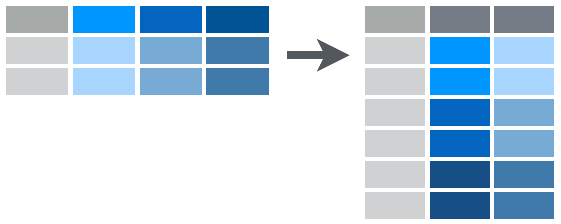

---
title       : Intro to R Programming for Biostatistics
subtitle    : "Day 2 - Cleaning and Transforming Data in R"
author      : Adam J Sullivan
job         : 
license     : by-nc-nd
framework   : io2012        # {io2012, html5slides, shower, dzslides, ...}
highlighter : highlight.js  # {highlight.js, prettify, highlight}
hitheme     : tomorrow      # 
widgets     : [mathjax, quiz, bootstrap, interactive]            # {mathjax, quiz, bootstrap}
mode        : selfcontained # {standalone, draft}
logo        : shield_image.png
biglogo     : shield_image_large.png
knit        : slidify::knit2slides
assets      : {assets: ../../assets}
---  .segue bg:grey


# Piping or Chaining Data


```{r setup, include = FALSE, cache = FALSE}
knitr::opts_chunk$set(error = TRUE)
knitr::opts_chunk$set(cache=TRUE)
knitr::opts_chunk$set(warning=FALSE)
knitr::opts_chunk$set(message=FALSE)
```


```{r, echo=FALSE}
# load packages
library(gapminder)
library(tidyverse)
library(dplyr)
load("C:/Users/adam_/Downloads/DSR-master/DSR-master/data/table1.Rdata")
load("C:/Users/adam_/Downloads/DSR-master/DSR-master/data/table2.Rdata")
load("C:/Users/adam_/Downloads/DSR-master/DSR-master/data/table3.Rdata")
load("C:/Users/adam_/Downloads/DSR-master/DSR-master/data/table4.Rdata")
load("C:/Users/adam_/Downloads/DSR-master/DSR-master/data/table5.Rdata")
load("C:/Users/adam_/Downloads/DSR-master/DSR-master/data/table6.Rdata")
```

--- .class #id

## Piping or Chaining

- We will discuss a concept that will help us greatly when it comes to working with our data. 
- The usual way to perform multiple operations in one line is by nesting. 

--- .class #id

## Piping or Chaining

To consider an example we will look at the data provided in the gapminder package:

```{r}
library(gapminder)
head(gapminder)
```

--- .class #id

## Nesting vs Chaining

- Let's say that we want to have the GDP per capita and life expectancy Kenya.
- Traditionally speaking we could do this in a nested manner:


```{r, eval=F}
filter(select(gapminder, country, lifeExp, gdpPercap), country=="Kenya")
```

--- .class #id

## Nesting vs Chaining

- It is not easy to see exactly what this code was doing but we can write this in a manner that follows our logic much better. 
- The code below represents how to do this with chaining. 

```{r, eval=F}
gapminder %>%
    select(country, lifeExp, gdpPercap) %>%
    filter(country=="Kenya")
```

--- .class #id

## Breaking Down the Code

- We now have something that is much clearer to read.
- Here is what our chaining command says:

1. Take the `gapminder` data
2. Select the variables: `country`, `lifeExp` and `gdpPercap`.
3. Only keep information from Kenya. 

- The nested code says the same thing but it is hard to see what is going on if you have not been coding for very long.


--- .class #id

## Breaking Down the Code

- The result of this search is below: 


```
# A tibble: 12 x 3
   country lifeExp gdpPercap
    <fctr>   <dbl>     <dbl>
 1   Kenya  42.270  853.5409
 2   Kenya  44.686  944.4383
 3   Kenya  47.949  896.9664
 4   Kenya  50.654 1056.7365
 5   Kenya  53.559 1222.3600
 6   Kenya  56.155 1267.6132
 7   Kenya  58.766 1348.2258
 8   Kenya  59.339 1361.9369
 9   Kenya  59.285 1341.9217
10   Kenya  54.407 1360.4850
11   Kenya  50.992 1287.5147
12   Kenya  54.110 1463.2493
```

--- .class #id

## What is `%>%`

- In the previous code we saw that we used `%>%` in the command you can think of this as saying ***then***.
- For example:

```{r, eval=F}
gapminder %>%
    select(country, lifeExp, gdpPercap) %>%
    filter(country=="Kenya")
```

--- .class #id

## What Does this Mean?

- This translates to:
    - Take Gapminder ***then*** select these columns select(country, lifeExp, gdpPercap) ***then*** filter out so we only keep Kenya


--- .class #id

## Why Chain?

- We still might ask why we would want to do this. 
- Chaining increases readability significantly when there are many commands. 
- With many packages we can replace the need to perform nested arguments. 
- The chaining operator is automatically imported from the [magrittr](https://github.com/smbache/magrittr) package. 

--- .class #id

## User Defined Function


- Let's say that we wish to find the Euclidean distance between two vectors say, `x1` and `x2`. 
- We could use the math formula:

\[\sqrt{sum(x1-x2)^2}\]

--- .class #id

## User Defined Function

- In the nested manner this would be:

```{r results='hide'}
x1 <- 1:5; x2 <- 2:6
sqrt(sum((x1-x2)^2))
```

--- .class #id

## User Defined Function


- However, if we chain this we can see how we would perform this mathematically. 
```{r, eval=FALSE}
# chaining method
(x1-x2)^2 %>% sum() %>% sqrt()
```
- If we did it by hand we would perform elementwise subtraction of `x2` from `x1` ***then*** we would sum those elementwise values ***then*** we would take the square root of the sum. 


--- .class #id

## User Defined Function


```{r}
# chaining method
(x1-x2)^2 %>% sum() %>% sqrt()
```

- Many of us have been performing calculations by this type of method for years, so that chaining really is more natural for us. 


---  .segue bg:grey

# The `spread()` Function

--- .class #id


## The `spread()` Function

- The first `tidyr` function we will look into is the `spread()` function. 
- With `spread()` it does similar to what you would expect.  
- We have a data frame where some of the rows contain information that is really a variable name. 
- This means the columns are a combination of variable names as well as some data. 

--- .class #id


The picture below displays this:


<center>

</center>


--- .class #id


We can consider the following data which is table 2:

```{r, echo=FALSE}
table2
```

--- .class #id

Notice that in the column of `key`, instead of there being values we see the following variable names:

- cases
- population

--- .class #id

In order to use this data we need to have it so the data frame looks like this instead:

```{r,echo=FALSE}
spread(table2, key, value)
```

--- .class #id

- Now we can see that we have all the columns representing the variables we are interested in and each of the rows is now a complete observation. 
- In order to do this we need to learn about the `spread()` function:

--- .class #id

## The `spread()` Function

```
spread(data, key, value)
```

Where

- `data` is your dataframe of interest. 
- `key` is the column whose values will become variable names. 
- `value` is the column where values will fill in under the new variables created from `key`. 

--- .class #id

## Piping

If we consider **piping**, we can write this as:

```
data %>%
  spread(key, value)
```

--- .class #id

## `spread()` Example


Now if we consider table2 , we can see that we have:

```{r,echo=FALSE}
table2
```

--- .class #id

## `spread()` Example

- Now this table was made for this example so key is the `key` in our `spread()` function and value is the `value` in our `spread()` function.
- We can fix this with the following code:

--- .class #id

## `spread()` Example

```{R}
table2 %>%
    spread(key,value)
```

--- .class #id

## `spread()` Example

- We can now see that we have a variable named `cases` and a variable named `population`. 
- This is much more tidy. 

--- .class #id

## On Your Own: RStudio Practice 

- We first will load tidyverse. 
- If you have not installed it run the following code:
    - `install.packages("tidyverse")`
- Then load this package:
    - `library(tidyverse)`


--- .class #id

## On Your Own: RStudio Practice 

- In this example we will use the dataset `population` that is part of tidyverse. 
- Print this data:

```{r, echo=FALSE}
library(tidyverse)
head(population,1)
```

--- .class #id

## On Your Own: RStudio Practice 

- You should see the table that we have above, now We have a variable named `year`, assume that we wish to actually have each year as its own variable. 
- Using the `spread()` function, redo this data so that each year is a variable. 
- Your data will look like this at the end:


--- .class #id

## On Your Own: RStudio Practice

```{r, echo=FALSE}
population %>% spread(year, population)
```


---  .segue bg:grey


# The `gather()` Function


--- .class #id


## The `gather()` Function

- The second `tidyr` function we will look into is the `gather()` function. 
- With `gather()` it may not be clear what exactly is going on, but in this case we actually have a lot of column names the represent what we would like to have as data values. 

--- .class #id


<center>

</center>


--- .class #id


## The `gather()` Function Example


- For example, in the last `spread()` practice you created a data frame where variable names were individual years. 
- This may not be what you want to have so you can use the gather function. 


--- .class #id


## Consider `table4`:

```{r, echo=FALSE}
table4

```

--- .class #id

## Table 4

- This looks similar to the table you created in the `spread()` practice.
- We now wish to change this data frame so that `year` is a variable and 1999 and 2000 become values instead of variables. 

--- .class #id


## In Comes the `gather()` Function

- We will accomplish this with the gather function:

```
gather(data, key, value, ...)
```
- where
    - `data` is the data frame you are working with. 
    - `key` is the name of the `key` column to create.
    - `value` is the name of the `value` column to create.
    - `...` is a way to specify what columns to gather from. 

--- .class #id


## `gather()` Example

In our example here we would do the following:

```{R}
table4 %>%
    gather("year", "cases", 2:3)
```

--- .class #id

- You can see that we have created 2 new columns called `year` and `cases`. 
- We filled these with the previous 2nd and 3rd columns. 
- Note that we could have done this in many different ways too. 


--- .class #id

- For example if we knew the years but not which columns we could do this:

```
table4 %>%
    gather("year", "cases", "1999":"2000")
```

- We could also see that we want to gather all columns except the first so we could have used:

```
table4 %>%
    gather("year", "cases", -1)
```


--- .class #id

## On Your Own: RStudio Practice

- Create `population2` from last example:

```{r, eval=FALSE}
population 2 <- population %>% 
                    spread(year, population)
```

- Now gather the columns that are labeled by year and create columns `year` and `population`. 


--- .class #id

## On Your Own: RStudio Practice


In the end your data frame should look like:

```{r,echo=FALSE}
head(population,2)
```


---  .segue bg:grey


# The `dplyr` Package


--- .class #id

## The `dplyr` Package

- Now that we have started to tidy up our data we can see that we have a need to transform this data. 
- We may wish to add additional variables. 
- The `dplyr` package allows us to further work with our data. 

--- .class #id


## `dplyr` Functionality

- With `dplyr` we have five basic verbs that we will learn to work with:
  - `filter()`
  - `select()`
  - `arrange()`
  - `mutate()`
  - `summarize()`

--- .class #id


## `dplyr` Functionality

- We also will consider:
  - `joins`
  - `group_by()`
  


---  .segue bg:grey


# Filtering 


--- .class #id

## Filtering


- At this point we will consider how we pick the rows of the data that we wish to work with. 
- If you consider many modern data sets, we have so much information that we may not want to bring it all in at once. 
- R brings data into the RAM of your computer. This means you can be limited for what size data you can bring in at once. 
- Very rarely do you need the entire data set. 
- We will focus on how to pick the rows or observations we want now.


--- .class #id

## Enter the `filter()` Function

- The `filter()` function chooses rows that meet a specific criteria. 
- We can do this with Base R functions or with   `dplyr`. 

```{r}
library(dplyr)
```


--- .class #id

## Filtering Example

- Let's say that we want to look at the data just for the country of Kenya in 2000
- We could do this without learning a new command and use indexing which we learned yesterday. 

```{r }
gapminder[gapminder$country=="Kenya" & gapminder$year==2002, ]
```

--- .class #id

## Filtering Example


- Now this is not very difficult to do, what we have is that we are working with `gapminder` and we only want to keep the rows of data there `country=="Kenya` and `year==2002`. 
- However we could use the `filter()` function to do this in a much easier to read format:

--- .class #id

## `filter()` Function

```
filter(.data, ...)
```

where

- `.data` is a tibble.
- `...` is a set of arguments the data you want returned needs to meet. 


--- .class #id

## Filtering Example

- This means in our example we could perform the following:

```
gapminder %>%
    filter(country=="Kenya", year==2002)
```

Finally we could also only do one filtering at a time and chain it:

```
gapminder %>%
    filter(country=="Kenya") %>%
    filter(year==2002)
```


--- .class #id


## Further Filtering

- `filter()` supports the use of multiple conditions where we can use Boolean. 
- For example if we wanted to consider only observations that have a life expectancy between 49 and 60, we could do the following:

```{r, eval=FALSE}
gapminder %>% filter(lifeExp>=49 & lifeExp<60)
```

--- .class #id


## Further Filtering

```{r, echo=FALSE}
gapminder %>% filter(lifeExp>=49 & lifeExp<60)
```

--- .class #id


## Further Filtering

- We can also use the `filter()` function to remove missing data for us. 
- Previously we learned about a class of functions called `is.`*foo*`()` where *foo* represents a data type. 
- We could choose to only use observations that have life expectancy. 
- That means we wish to not have missing data for life expectancy. 


```{r, eval=FALSE}
gapminder %>% filter(!is.na(lifeExp))
```

--- .class #id


## On Your Own: RStudio Practice


Using the `filter()` function and chaining: 

- Choose only rows associated with
  - Uganda
  - Rwanda

--- .class #id


## On Your Own: RStudio Practice


Your end result should be:

```{R, echo=FALSE}
filter(gapminder, country=="Uganda" | country=="Rwanda")
```

---  .segue bg:grey


# Selecting


--- .class #id

## Selecting

- The next logical step would be to select the columns we want as well. 
- Many times we have so many columns that we are no interested in for a particular analysis. 
- Instead of slowing down your analysis by continuing to run through extra data, we could just select the columns we care about. 

--- .class #id


## Enter the `select()` Function

- The `select()` function chooses columns that we specify. 
- Again we can do this with base functions or with `dplyr`. 
- We feel that as you continue on with your R usage that you will most likely want to go the route of `dplyr` functions instead.

--- .class #id

## Select Example

- Let's say that we want to look at the gapminder data but we are really only interested in the country, life expectancy and year. 
- This seems reasonable if we are a customer and wanted to only know these pieces of information. We could do this with indexing : 

```{r, eval=FALSE}
gapminder[, c("country", "lifeExp", "year")]
```

--- .class #id

## `select()` Function

```
select(.data, ...)
```

where 

- `.data` is a tibble.
- `...` are the columns that you wish to have in bare (no quotations)


--- .class #id

## Selecting Example Continued

We could then do the following

```{r,eval= FALSE}
gapminder %>%
  select(country, lifeExp, year)
```


--- .class #id

## Selecting Example Continued


```
# A tibble: 1,704 x 3
       country lifeExp  year
        <fctr>   <dbl> <int>
 1 Afghanistan  28.801  1952
 2 Afghanistan  30.332  1957
 3 Afghanistan  31.997  1962
 4 Afghanistan  34.020  1967
 5 Afghanistan  36.088  1972
 6 Afghanistan  38.438  1977
 7 Afghanistan  39.854  1982
 8 Afghanistan  40.822  1987
 9 Afghanistan  41.674  1992
10 Afghanistan  41.763  1997
# ... with 1,694 more rows
```


--- .class #id

## Removing Columns


- We may wish to pick certain columns that we wish to have but we also may want to remove certain columns. 
- It is quite common to de-identify a dataset before actually distributing it to a research team. 
- The `select()` function will also remove columns. 


--- .class #id

## Removing Columns

- Lets say that we wished to remove the `gdpPercap` and `pop` of the countries:

```{R, eval=FALSE}
gapminder %>%
  select(-gdpPercap,-pop)
```

--- .class #id

## Removing Columns

We also could use a vector for this:

```{R, eval=F}

cols <- c("gdpPercap", "pop")
gapminder %>%
  select(-one_of(cols))
```

--- .class #id

## Removing Columns

- We can also remove columns that contain a certain phrase in the name. 
- If we were interested in removing any columns that had to do with time we could search for the phrase "co" in the data and remove them:

```{r, eval= FALSE}
gapminder %>%
  select(-matches("co"))
```

--- .class #id

## Removing Columns


```{r, echo= FALSE}
gapminder %>%
  select(-matches("co"))
```

--- .class #id

## Unique Observations

- Many times we have a lot of repeats in our data. 
- If we just would like to have an account of all things included then we can use the `unique()` command. 
- Lets assume that we wish to know which countries are in the data. 
- We do not want to have every country listed over and over again so we ask for unique values:

```{r, eval=F}
gapminder %>% 
  select(country) %>% 
  unique()
```


--- .class #id

## On Your Own: RStudio Practice

- Consider the gapminder data: `gapminder`. 
  1. Select all but the `pop` column.
  2. Remove the year and lifeExp from them.
  3. Select values which contain "p" in them. 
  4. Chain these together so that you run a command and it does all of these things. 

--- .class #id

## On Your Own: RStudio Practice


Your answer should look like:

```{R, echo=FALSE}
gapminder %>% select(-pop)  %>% select(-lifeExp,-year) %>% select(contains("p"))
```

