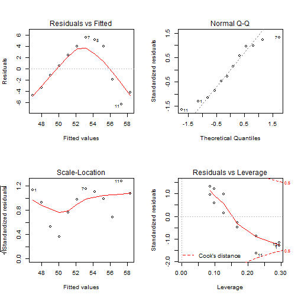
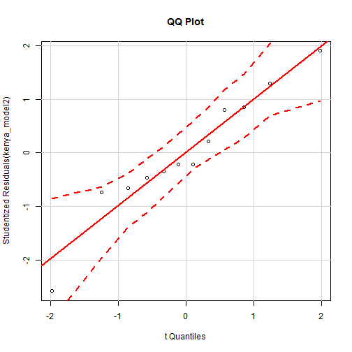

---
title       : Intro to R Programming for Biostatistics
subtitle    : "Day 3 - Graphics in R"
author      : Adam J Sullivan
job         : 
license     : by-nc-nd
framework   : io2012        # {io2012, html5slides, shower, dzslides, ...}
highlighter : highlight.js  # {highlight.js, prettify, highlight}
hitheme     : tomorrow      # 
widgets     : [mathjax, quiz, bootstrap, interactive]            # {mathjax, quiz, bootstrap}
mode        : selfcontained # {standalone, draft}
logo        : shield_image.png
biglogo     : shield_image_large.png
knit        : slidify::knit2slides
assets      : {assets: ../../assets}
---  .segue bg:grey


# `ggplot2`


--- .class #id

## `ggplot2`


- We will begin our journey into statistical graphics with the package `ggplot2`. 
- This is another package by Hadley Wickham and is part of the tidyverse. 
- This means we can use `piping` or  `chaining` to build our graphics. 

--- .class #id

## What can't `ggplot2` do?


- A good place to start might be with what  `ggplot2` cannot do. From here we will introduce what it can do. 
  - 3d graphs.
  - Interactive graphs, use `ggvis`
  - DAGs, see `igraph`


--- .class #id


## `ggplot2` components


- As we start with `ggplot2` it is important to understand the structure of this. 
- The base graphics built into R require the use of many different functions and each of them seem to have their own method for how to use them.   
- `ggplot2` will be more fluid and the more you learn about it the more amazing of graphics you can create. 

--- .class #id


## `ggplot2` components


- We will get started with the components of every `ggplot2` object:
  1. **data**
  2. **aesthetic mappings** between variables in the data and visual properties.
  3. At least one layer which describes how to render the data. 
    - Many of these are with the **geom()** function. 


--- .class #id


## HERS Study

- This is a longitudinal study of HIV in women. 
- We have variables from the 8th visit following baseline.
- Baseline corresponds to study enrollment, which is visit 1.
- Visits occur every 6 months.


--- .class #id

## HERS Study


```r
library(haven)
data <- read_dta("hers.dta")
data$race <- as.factor(data$race)
```


--- .class #id

## HERS Study


```
## # A tibble: 371 x 19
##         id  basecd4 basevl   cd4cnt symptom    vl haart haart_1  cd4ct_1
##      <chr>    <dbl>  <dbl>    <dbl>   <dbl> <dbl> <dbl>   <dbl>    <dbl>
##  1 0200775 485.1000    130 243.8100       2   580     0       0 312.4800
##  2 0401574 434.8750     50 449.3120       0    50     0       0 398.7530
##  3 0202540 285.4800  95050 308.0000       2    50     0       1 243.6000
##  4 0202335 624.2200   3390 520.2000       2   170     1       1 392.7000
##  5 0202642 211.4200  50390 225.0000       0    50     0       0 131.6000
##  6 0402166 304.0450   1720 352.5785       0   730     1       1 475.3782
##  7 0401041 266.7696   2070 304.9728       1  3800     0       1 347.7274
##  8 0201516 524.5200   2040 425.6000       0    50     0       0 389.1600
##  9 0102072 213.1800  10570 332.8000       0    50     0       0 256.0000
## 10 0102505 418.0000    160 378.0000       1    50     0       0 319.7700
## # ... with 361 more rows, and 10 more variables: vl_1 <dbl>, prog_1 <dbl>,
## #   symp_1 <dbl>, awareyr <dbl>, race <dbl>, site <chr>, iduever <dbl>,
## #   idu6enrl <dbl>, blart <dbl>, yrsaware <dbl>
```

--- .class #id


## `ggplot2` Basics


For example, we will create a simple scatter plot of cd4 count by viral load:


```r
library(dplyr)
library(ggplot2)


ggplot(data, aes(x=cd4cnt, y= vl)) +
      geom_point()
```

--- .class #id


## `ggplot2` Basics

- What the code first does is takes a random 0.5% sample of all of the flights data. 
- Given that the original data has 336,776 flights, it can be hard to visualize this much data with any clarity so we will observe a sample for this. 
- We then see that the aesthetic mapping is cd4cnt by departure viral load. 
- Finally we have a layer of points. This then leads to the following graph: 

--- .class #id


## `ggplot2` Basics


--- .class #id


## `ggplot2` Basics


As we proceed through this section we will begin the graph things in the following pattern:

1. data
2. aesthetic mappings
3. geometric objects
4. statistical transformations
5. scales
6. coordinate systems
7. position adjustments
8. faceting

---  .segue bg:grey


# Aesthetic Attributes


--- .class #id

## Aesthetic Attributes

- We have focused on the data up until this point and now we will look at the aesthetic attributes.
- These consist of:
  - Color
  - size
  - shape

--- .class #id


## Color

- To start we will focus on the color. We will look at 
  1. Color by groups. 
  2. Color of points. 


--- .class #id

## Color by Groups

- An important way to distinguish data can be to change the color of the groups. 
- `ggplot2`` has many default scales that convert your groups to color levels. 
- These can be overridden but we will stick to the basics for now. 

--- .class #id

## Color by Groups

- We consider the same plot that we used before and now we will add color by the race :


```r
library(dplyr)
library(ggplot2)


ggplot(data, aes(x=cd4cnt, y= vl, color=race)) +
      geom_point()
```
- The code shows that in the aesthetic portion (`aes()`) and we have added that `race` is associated with color. 


--- .class #id

## Color by Groups


--- .class #id

## Color of points

Not only can we add color to the aesthetic portion but we can add it into the particular layers. 


```r
library(dplyr)
library(ggplot2)


ggplot(data, aes(x=cd4cnt, y= vl)) +
      geom_point(color=blue)
```

--- .class #id

## Color of points


--- .class #id

## Size


Now that we can color the points and color by groups we can also add the attributes of different sizes. 


```r
library(dplyr)
library(ggplot2)


ggplot(data, aes(x=cd4cnt, y= vl, size=symptom)) +
      geom_point()
```
- Note that whenever you see an attribute inside the `aes()` function it applies that attribute to a particular variable. 
- In this case, the size of the points will be increased depending on the number of symptoms.

--- .class #id

## Size


--- .class #id

## Shape

- One other important attribute to distinguish between groups can be to have a unique shape for each group. 
- This time we add `shape=race` into the `aes()` function and have a unique shape for each specific race. 


```r
library(dplyr)
library(ggplot2)


ggplot(data, aes(x=cd4cnt, y= vl, shape = race)) +
      geom_point()
```

--- .class #id

## Shape


```
## Error: A continuous variable can not be mapped to shape
```



---  .segue bg:grey


# Facetting

--- .class #id

## Facetting

- Facetting is an excellent way to look at categorical data. 
- This is where we split up the graphs and create a graph for each category.
- We will learn about two basic functions:
    - `facet_wrap`
    - `facet_grid`

--- .class #id

## `facet_wrap`


- We first will consider a `facet_wrap`:

    
    ```r
    ggplot(data, aes(x=cd4cnt, y= vl)) +
        geom_point() +
        facet_wrap(~race)
    ```

--- .class #id

## `facet_wrap`

- Notice that we are still working with the cd4cnt versus viral load. 
- We start out with our original scatter plot. 
- Then we add yet another `layer`. 
- This layer is the `facet_wrap()` where we wrap it based on race. 


--- .class #id

## `facet_wrap`


--- .class #id


## `facet_grid`

We then will note a similar effect when we use `facet_grid()`:


```r
ggplot(data, aes(x=cd4cnt, y= vl)) +
      geom_point() +
      facet_grid(~race)
```

--- .class #id


## `facet_grid`


- This is where the language of graphs really helps. 
- We first take the data and group it based on cd4cnt and viral load. 
- We state to place these as points on a graph. 
- Finally we use the  `facet_grid()` to take that plot and split it by the race. 
- Each time you add a layer you can accomplish a little more towards your goal.

--- .class #id


## `facet_grid`


--- .class #id


## What about Other plots?

So far we have been focusing on scatter plots. As we continue to move through this section we will note that there are many other `geom` functions that can be used:
 
- `geom_smooth` fits a smoothing line in data
- `geom_boxplot` box and whisker plot of data
- `geom_histogram` and `geom_freqpoly` distribution graphs
- `geom_bar` distribution of categorical data
- `geom_path` and `geom_line` lines between data points


---  .segue bg:grey


# Smoothing

--- .class #id

## Smoothing


- It can be hard to view trends with just points alone. 
- Many times we wish to add a smoothing line in order to see what the trends look like. 
- This can be especially helpful when trying to understand regressions.

--- .class #id

## Smoothing

- We will take out scatter plot and apply a smoothing line to this:


```r
ggplot(data, aes(x=cd4cnt, y= vl)) + 
        geom_point() +
        geom_smooth()
```


--- .class #id

## Smoothing

- Again, the smoothing line comes after our points which means it is another layer added onto our graph:


--- .class #id

## Smoothing


- Note that the `geom_smooth()` function adds confidence bands on the smooth as well. 
- We can remove these by adding `se=FALSE` inside the `geom_smooth()` function: 


```r
ggplot(data, aes(x=cd4cnt, y= vl)) + 
        geom_point() +
        geom_smooth(se=FALSE)
```


--- .class #id

## Smoothing


--- .class #id

## On Your Own: Rstudio Practice

- Consider what happens when you switch the layers around. 
  1. Graph just the data step:
    ```
    ggplot(data, aes(x=cd4cnt, y= vl))
    ```
  2. Then add just the smooth
    ```
    ggplot(data, aes(x=cd4cnt, y= vl)) + 
      geom_smooth()
    ```
  3. Finally add the points in:
    ```
    ggplot(data, aes(x=cd4cnt, y= vl)) + 
        geom_smooth() + 
        geom_point()
    ```


--- .class #id


## Varying the Smooth

- We have so far just seen how to add the smooth without being  able to do anything but add or subtract the confidence bands. 
- We now will change the smoothness of our smooth that we added. 
- To do so we add `span=__` inside the `geom_smooth()` layer:


```r
ggplot(data, aes(x=cd4cnt, y= vl)) + 
        geom_point() +
        geom_smooth(span = 0.1)
ggplot(data, aes(x=cd4cnt, y= vl)) + 
        geom_point() +
        geom_smooth(span = 1)
```

--- .class #id


## Varying the Smooth


--- .class #id


## Varying the Smooth

- Note that with `span = 0.1` we have a more rough smoothing than we had previously. 




--- .class #id

## Different Types of Smooths

- There are different types of smooths that we can do. We will consider:
  - `loess`
  - `gam`


--- .class #id


## Loess Smooths

- Loess smoothing is a process by which many statistical software do smoothing. 
- In `ggplot2` this should be done when you have less than 1000 points, otherwise it can be time consuming. 


```r
ggplot(data, aes(x=cd4cnt, y= vl)) + 
        geom_point() +
        geom_smooth(method="loess")
```

--- .class #id


## Loess Smooths

- As you can see with the code we just add `method="loess"` into the `geom_smooth()` layer. 


--- .class #id


## `gam` Smoothing


- `gam` smoothing is called generalized additive mode smoothing.
- It works with a large number of points. 
- We specify this by adding `method="gam", formula = y~s(x)` into the `geom_smooth()` layer. 


```r
library(mgcv)
ggplot(data, aes(x=cd4cnt, y= vl)) + 
        geom_point() +
        geom_smooth(method="gam", formula = y ~s(x))
```

--- .class #id


## `gam` Smoothing

- The code for this is very similar and we can see how it looks below:


---  .segue bg:grey


# Graphs to Compare Categorical and Continuous Data


--- .class #id

## Graphs to Compare Categorical and Continuous Data

- Many times we need to compare categorical and continuous data. 
- We will consider the following `geom_` functions to do this:
  - `geom_jitter` adds random noise
  - `geom_boxplot` boxplots
  - `geom_violin` compact version of density 

--- .class #id

## Jitter Plot

- In when you group continuous data into different categories, it can be hard to see where all of the data lies since many points can lie right on top of each other.  
- The jitter plot will and a small amount of random noise to the data and allow it to spread out and be more visible. 


```r
ggplot(data, aes(x=race, y= vl)) +
        geom_jitter()
```
- We can add this as another layer just like we did with `geom_point()` .


--- .class #id

## Jitter Plot


--- .class #id


## Boxplot

- Boxplots are one of the most commonly used statistics plots to display continuous data. 
- It is extremely useful to evaluate the distribution of a continuous random variable across multiple groups. 
- We can easily make this by adding a `geom_boxplot()` layer:


```r
ggplot(data, aes(x=race, y= vl)) + 
        geom_boxplot()
```

--- .class #id

## Boxplot


--- .class #id


## Violin

- Another plot to help display continuous data among different categories. 
- In order to deal with multiple data points lying in a close area, the violin plot is wider at points where the data is bulked. 
- We can simply code this with a `geom_violin()` layer:


```r
ggplot(data, aes(x=race, y= vl)) + 
        geom_violin()
```

--- .class #id


## Violin


---  .segue bg:grey


# Continuous Distributions


--- .class #id

## Continuous Distributions

- If we consider just looking at continuous variables we become interested in understanding the distribution that this data takes on. 
- We will explore continuous data using:
  - `geom_histogram()` shows us the distribution of one variable.
  - `geom_freqplot` uses lines rather than boxes to show the distribution.


--- .class #id

## Histograms

- Another very common graphic that most people have seen and used is the histogram.
- This is common among continuous data where the data is split up into bins and the frequency of those bins is displayed. 
- They are not to be confused with bar charts though! 
- There are no gaps in a histogram. We can add a histogram layer simply by using the `geom_histogram()`, if we would like to specify the width of bins we can do that by using `binwidth=__`:


```r
ggplot(data, aes)) + 
        geom_histogram(binwidth=25)
ggplot(data, aes( vl)) + 
        geom_histogram(binwidth=1)
```


--- .class #id

## Histograms


--- .class #id

## Histograms

- If we wanted to allow for more preciseness then we could use the bin width of 1:


--- .class #id


## Frequency Plots


- Frequency plots are very similar to histograms. 
- Instead of just having bars to display the frequency in a bin, the frequency plot would place a point at the height of the bar and then connect them with lines. We can simply add this with the `geom_freqpoly()` layer. 
- We again can use the `binwidth=__` command:


```r
ggplot(data, aes(cd4cnt)) + 
        geom_freqpoly(binwidth=25)
ggplot(data, aes( cd4cnt)) + 
        geom_freqpoly(binwidth=1)
```

--- .class #id


## Frequency Plots


--- .class #id


## Frequency Plots

- We can also use a more precise bin width. 


--- .class #id

## Adding Aesthetics

- Just like in the earlier part of this unit we saw that it was possible to add a great deal of aesthetics to plots. 
- We will now view how these changes work on these `geom_` functions:


```r
ggplot(data, aes(cd4cnt, color=race)) + 
        geom_freqpoly(binwidth=25)
```

--- .class #id

## Adding Aesthetics


- If we add grouping color by race we can see the plot below. 
- Notice that we now have multiple frequency plots without having to use faceting. 


--- .class #id

## Adding Aesthetics


--- .class #id

## Adding Aesthetics

- Instead of just coloring the lines, we can use the `fill=__` function in order to fill a color by race in this case. 
- Then we create histograms and finally in order to separate the plots out so we can see things better we use facetting:


```r
ggplot(data, aes( cd4cnt, fill = race)) + 
        geom_histogram(binwidth=20) + 
        facet_wrap(~race)
```

--- .class #id

## Adding Aesthetics


---  .segue bg:grey


# Extra Graphs


--- .class #id


## Bar Charts


```r
ggplot(data, aes( race) )+
         geom_bar()
```

--- .class #id


--- .class #id

## Line and Path plots


```r
ggplot(data, aes(cd4cnt, vl)) + 
  geom_line()
```

--- .class #id


---  .segue bg:grey


# Labeling


--- .class #id

## Labeling

- It is very important when making graphs to be able to label features. 
- We will look at various ways in which we can label our graphics now. 

--- .class #id

## Labeling the Axes

- We can add a lot of features to the axes but for now we will just change labels. 
- We use `xlab` and `ylab` for this, if we set them to `NULL` we have blank axes labels. 
- For example we can make a graph based on departure viral load and speed:


```r
ggplot(data, aes(vl, cd4cnt)) +
    geom_point(alpha = 1 / 3) +
    xlab("Viral Load)") +
    ylab("CD4 Count")
```

--- .class #id

## Labeling the Axes

- We can see that the `xlab()` and the `ylab()` functions are just added in as layers. 
- They produce the graph below. 


--- .class #id

## Other Text Labels

- Aside from labeling the axes, many times we want to add other text into our graphics. `geom_text` will allow a user to add text to a graph. 
- We simply add `geom_text()` as a layer and this layer has the following options:
    - the option `family` allows a user to specify font.
    - the option `fontface` allows a user to specify: plain, bold or italic.
    - `hjust, vjust` allows a user to specify location of the text.
    - `size` allows the user to adjust the size of a graph. 


--- .class #id

## Font Families

- We will first look at the different font styles that could be used with `geom_text()` using the `family` option.  
- These 3 fonts work with every type of graph in ggplot: 


```r
df <- data.frame(x = 1, y = 3:1, family = c("sans", "serif", "mono"))
ggplot(df, aes(x, y)) +
geom_text(aes(label = family, family = family))
```

--- .class #id

## Font Families


--- .class #id


## Font Face Styles

- Many times we also wish to add other attributes to our text. 
- The font face allows for plain text, **bold text**, and *italic text*. 
    
    ```r
    df <- data.frame(x = 1, y = 3:1, face = c("plain", "bold", "italic"))
    ggplot(df, aes(x, y)) +
    geom_text(aes(label = face, fontface = face))
    ```
- Once again, `geom_text()` is a layer and this time we use the text labels of:
    - plain
    - bold
    - italic

--- .class #id


## Font Face Styles


--- .class #id

## Nudge to label existing points

- The nudge allows us to move the text horizontally or vertically to label points. 
- If we did not do this, our text would lie directly on top of the point. 
- We use `nudge_x` and `nudge_y` in order to move the text in the `x` and `y` direction respectively.


```r
df <- data.frame(trt = c("a", "b", "c"), resp = c(1.2, 3.4, 2.5))
ggplot(df, aes(resp, trt)) +
    geom_point() +
    geom_text(aes(label = paste0("(", resp, ")")), nudge_y = -0.25) +
    xlim(1, 3.6)
```

--- .class #id

## Nudge to label existing points


--- .class #id

## Labels Rather than a Legend

- One other common feature of a graph can be to use labeling rather than a legend. 
- The code is a bit more advanced for this phase, below you can see that we have done a few different things. 
    1. We created 2 plots `p1` and `p2`. 
    2. `p2` uses `geom_dl()` to add labels as a legend
    3. `grid.arrange()` allows us to place the graphs side by side. 


```r
library(directlabels)
library(gridExtra)
p1 = ggplot(mpg, aes(displ, hwy, colour = class)) +
    geom_point()
p2 = ggplot(mpg, aes(displ, hwy, colour = class)) +
    geom_point(show.legend = FALSE) +
    geom_dl(aes(label = class), method = "smart.grid")
grid.arrange(p1,p2, ncol=2)
```


--- .class #id


--- .class #id


## Other Aesthetic Mappings

Sometimes we map aesthetics to constant values. This allows us to distinguish between layers.


```r
ggplot(data, aes(cd4cnt,vl )) + 
    geom_point() + 
    geom_smooth(aes(color="lm"), method="lm", se=F) + 
    geom_smooth(aes(color="loess"), method="loess", se=F) + 
  labs(color = "Method")
```

--- .class #id


--- .class #id


## Statistical Transforms

- Many times we wish to do more than what we have seen at this point. 
- We wish to add different statistical features to the graph. `stat` transforms the data. 
- This is typically just a summary of some sort. 
- Useful ones are smoothing or identity. 
- You typically do not call them directly but the `geom` does. 


```r
ggplot(data, aes(race, vl)) + 
    geom_point() + 
    stat_summary(geom = "point", fun.y = "mean", color = "red", size = 3)

ggplot(data, aes(race, vl)) + 
    geom_point()+ 
    geom_point(stat = "summary", fun.y = "mean", color = "red", size = 3)
```

--- .class #id


--- .class #id


## Position Adjustments

- We can use position adjustments to tweak the position of elements. 
- For example with bars:
    - `position_stack()` stack overlapping bars
    - `position_fill()` stack overlapping bars and scale to 1
    - `position_dodge()` place overlapping bars next to each other.
    


```r
dplot <- ggplot(diamonds, aes(color, fill = cut)) +
    xlab(NULL) + ylab(NULL) + theme(legend.position = "none")
    # position stack is the default for bars, so geom_bar()
    # is equivalent to geom_bar(position = "stack").
    p1 = dplot + geom_bar()
    p2 = dplot + geom_bar(position = "fill")
    p3 = dplot + geom_bar(position = "dodge")
grid.arrange(p1,p2,p3, ncol=3)
```

--- .class #id


---  .segue bg:grey

# Modifying Axes and Scales

--- .class #id


## Axes and Legends

- We can modify both axes and legends. `ggplot2` actually considers these objects to be the same type of object. 
- This means if we learn the tools to work with a legend then we can change the Axes in the same way and vice-verse. 


| Axis              |      Legend    |  Argument Name |
|-----------------  |  --------------  |  ------------- |
|Label      |         Title      |     `name` |
|Ticks, grid line  |  Key         |    `breaks` |
|tick Label       |   Key Label    |   `labels` |


--- .class #id


## Scales

- Scales are required and included in every plot. 
- If we do  not specify them, `ggplot2` includes them in the background. 
- For example:
```
geom(data, aes(cd4cnt, vl)) +
    geom_point(aes(color="race"))
```

is  read in by `ggplot2` as : 

```
geom(data, aes(cd4cnt, vl))+ 
    geom_point(aes(color="race")) + 
    scale_x_continuous() + 
    scale_y_continuous() + 
    scale_color_discrete()
```

--- .class #id


## Scale Title

- The first argument in a scale function is the axes/legend title. 
- We can use 2 types of text:
    - Strings
    - Mathematical Expressions
- For example we will create 2 plots below. 
- They will be the same plot but we will allow the first one to just be a string and the second to be a mathematical expression. 


--- .class #id

## Scale Title


    

```r
df <- data.frame(x = 1:2, y = 1, z = "a")
    p <- ggplot(df, aes(x, y)) + geom_point()
    p1 = p + scale_x_continuous("X axis")
    p2 = p + scale_x_continuous(quote(a + mathematical ^ expression))
grid.arrange(p1,p2, ncol=2)
```


--- .class #id

## Scale Title


--- .class #id


## Labeling a Scale


- Earlier we learned about common labeling functions such as:
  - `xlab`
  - `ylab`
  - `labs`
- We can also use common text notations in order to add further details:


```r
p <- ggplot(df, aes(x, y)) + geom_point(aes(colour = z))
    p1 = p + xlab("X axis") + ylab("Y axis")
    p2 = p + labs(x = "X axis", y = "Y axis", 
                  colour = "Colour\nlegend")
grid.arrange(p1,p2, ncol=2)
```


--- .class #id


--- .class #id


## Breaks and Labels

- We not only like to be able to change the labels of scales but it can be helpful to choose the tick marks as well. 
- The  `breaks` argument controls what values appear as the tick marks on axes and keys.


```r
df <- data.frame(x = c(1, 3, 5) * 1000, y = 1)
axs <- ggplot(df, aes(x, y)) +
geom_point() +
labs(x = NULL, y = NULL)
axs
axs + scale_x_continuous(breaks = c(2000, 4000))
axs + scale_x_continuous(breaks = c(2000, 4000), labels = c("2k", "4k"))
```


--- .class #id


--- .class #id

- As it was state before `ggplot2` considers axes and legends to be the same type.
- This means if we are creating a continuous scale with a bar graph coloring or even a heat map we can change the tick marks on the legend as well. 


```r
leg <- ggplot(df, aes(y, x, fill = x)) +
    geom_tile() +
    labs(x = NULL, y = NULL)
leg
leg + scale_fill_continuous(breaks = c(2000, 4000))
leg + scale_fill_continuous(breaks = c(2000, 4000), labels = c("2k", "4k"))
```
- We see that just like the axes above we now have three different legends with the tick marks and labels of them changed. 
 

--- .class #id


--- .class #id


- We can also force different axes to be on a discrete scale rather than continuous. 


```r
df2 <- data.frame(x = 1:3, y = c("a", "b", "c"))
ggplot(df2, aes(x, y)) +
    geom_point()
ggplot(df2, aes(x, y)) +
    geom_point() +
    scale_y_discrete(labels = c(a = "apple", 
                                b = "banana", c = "carrot"))
```


--- .class #id


---  .segue bg:grey


# Legends

--- .class #id

## Legends

- Many of the previous characteristics are the same for both axes and legends. 
- Legends can:
  - Display multiple aesthetics from multiple layers
  - Appear in many different locations.
  - Can be sized and ordered differently. 
- You can also choose what is placed in a legend. 
- We use the `show.legend` command to do this.

--- .class #id

## Legends


```r
ggplot(df, aes(y, y)) +
    geom_point(size = 4, colour = "grey20") +
    geom_point(aes(colour = z), size = 2)
ggplot(df, aes(y, y)) +
    geom_point(size = 4, colour = "grey20", 
               show.legend = TRUE) +
    geom_point(aes(colour = z), size = 2)
```

--- .class #id

## Legends


- Sometimes we wish to have the legends display different things. 
- For example if we use transparent colors in the plot we may want solid colors in the legend. 
- The `alpha` command will make the colors more transparent. 
- However we can override the legend colors and set the `alpha` differently: 


```r
norm <- data.frame(x = rnorm(1000), y = rnorm(1000))
norm$z <- cut(norm$x, 3, labels = c("a", "b", "c"))
ggplot(norm, aes(x, y)) +
    geom_point(aes(colour = z), alpha = 0.1)
ggplot(norm, aes(x, y)) +
    geom_point(aes(colour = z), alpha = 0.1) +
    guides(colour = guide_legend(override.aes = list(alpha = 1)))
```

--- .class #id

## Legends


--- .class #id


## Legend Layouts

- We can choose the specific layout of the legend. 
- For example we can place it at the  "top", "bottom", "right" , "left" or not even have a legend at all.


```r
df <- data.frame(x = 1:3, y = 1:3, z = c("a", "b", "c"))
base <- ggplot(df, aes(x, y)) +
    geom_point(aes(colour = z), size = 3) +
    xlab(NULL) +
    ylab(NULL)
base + theme(legend.position = "right") # the default
base + theme(legend.position = "bottom")
base + theme(legend.position = "none")
```

--- .class #id

## Legends


