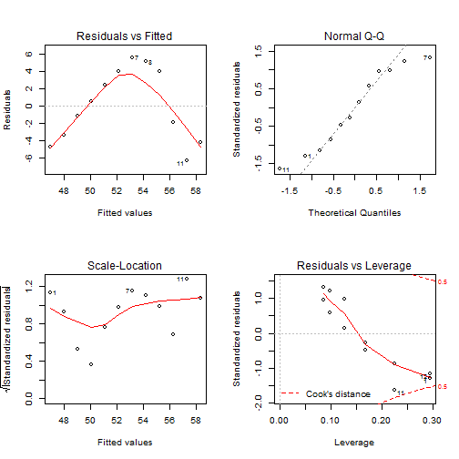
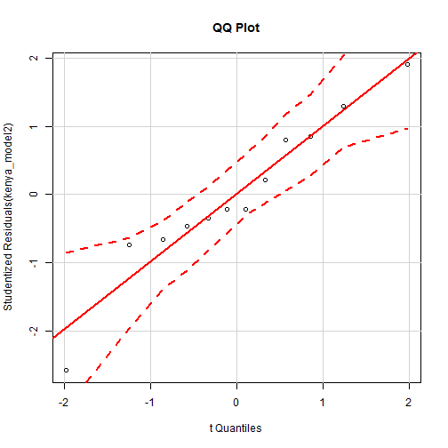
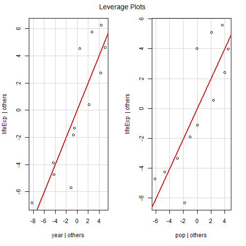
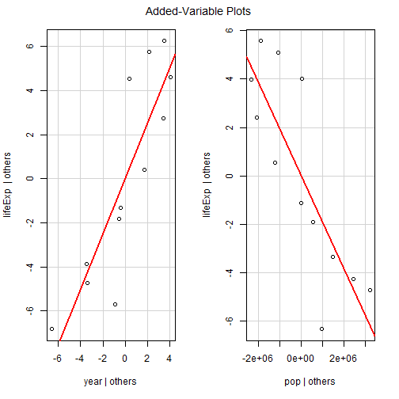
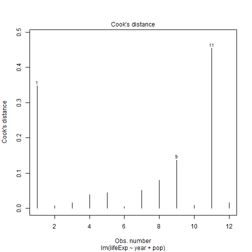
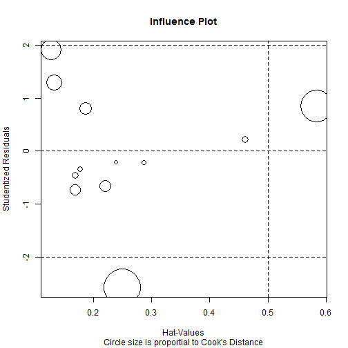
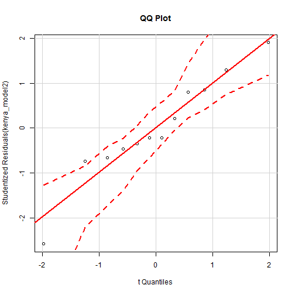
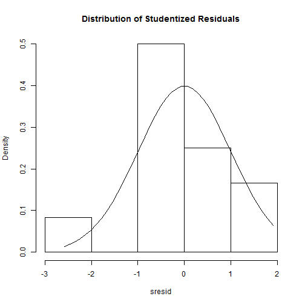

---
title       : Intro to R Programming for Biostatistics
subtitle    : "Day 3 - Regression in R"
author      : Adam J Sullivan
job         : 
  license     : by-nc-nd
framework   : io2012        # {io2012, html5slides, shower, dzslides, ...}
highlighter : highlight.js  # {highlight.js, prettify, highlight}
hitheme     : tomorrow      # 
widgets     : [mathjax, quiz, bootstrap, interactive]            # {mathjax, quiz, bootstrap}
mode        : selfcontained # {standalone, draft}
logo        : shield_image.png
biglogo     : shield_image_large.png
knit        : slidify::knit2slides
assets      : {assets: ../../assets}
---  .segue bg:grey


# Regression Models in R


---  .segue bg:grey

# Linear Regression in R

--- .class #id

## Linear Regression in R


- We can use R to easily fit linear regressions for us. 
- This section will explore the basic commands for linear regression as well as how to test assumptions. 
- We will not teach linear regression, but only seek to display how R does it. 


--- .class #id

## `lm()` Function in R

- To fit Linear Regression models in R we use the `lm()` function. 

```
lm(formula, data, subset, weights, na.action,
   method = "qr", model = TRUE, x = FALSE, y = FALSE, qr = TRUE,
   singular.ok = TRUE, contrasts = NULL, offset, ...)
```

- `formula` is the regressino equation written as `y~x1 + x2+ ...`
- `data` is the dataframe of interest.
- `subset` specific subset of data. 
- `weights` for weighted data. 
- ...

--- .class #id

## Gapminder Data

- Worldwide data source. 
- Contains 6 variables

| Variable  | Meaning |
| --------  | ------- |
| country   | Country Name |
| continent | Continent Name |
| year  |  Year Data Accounts For |
| lifeExp | Life Expectancy at Birth | 
| pop | Total Population | 
| gdpPercap | per-Capita GDP | 

- Per-capita GDP (Gross domestic product) is given in units of international dollars, "a hypothetical unit of currency that has the same purchasing power parity that the U.S. dollar had in the United States at a given point in time" -- 2005, in this case.


--- .class #id

## Gapminder Data


```r
library(gapminder)
```

--- .class #id

## Gapminder Data


```
## # A tibble: 1,704 x 6
##        country continent  year lifeExp      pop gdpPercap
##         <fctr>    <fctr> <int>   <dbl>    <int>     <dbl>
##  1 Afghanistan      Asia  1952  28.801  8425333  779.4453
##  2 Afghanistan      Asia  1957  30.332  9240934  820.8530
##  3 Afghanistan      Asia  1962  31.997 10267083  853.1007
##  4 Afghanistan      Asia  1967  34.020 11537966  836.1971
##  5 Afghanistan      Asia  1972  36.088 13079460  739.9811
##  6 Afghanistan      Asia  1977  38.438 14880372  786.1134
##  7 Afghanistan      Asia  1982  39.854 12881816  978.0114
##  8 Afghanistan      Asia  1987  40.822 13867957  852.3959
##  9 Afghanistan      Asia  1992  41.674 16317921  649.3414
## 10 Afghanistan      Asia  1997  41.763 22227415  635.3414
## # ... with 1,694 more rows
```

--- .class #id

## Gapminder Regression


```r
kenya <- gapminder %>% filter(country=="Kenya")
kenya_model <- lm(lifeExp ~ year, data=kenya)
kenya_model
```

```
## 
## Call:
## lm(formula = lifeExp ~ year, data = kenya)
## 
## Coefficients:
## (Intercept)         year  
##   -356.1010       0.2065
```

--- .class #id

## Gapminder Regression

- Basic Model Statement does not include much information
- If we look further we can see what type of object is returned:


```r
str(kenya_model)
```

```
## List of 12
##  $ coefficients : Named num [1:2] -356.101 0.207
##   ..- attr(*, "names")= chr [1:2] "(Intercept)" "year"
##  $ residuals    : Named num [1:12] -4.732 -3.349 -1.118 0.554 2.427 ...
##   ..- attr(*, "names")= chr [1:12] "1" "2" "3" "4" ...
##  $ effects      : Named num [1:12] -182.492 12.347 0.283 1.805 3.527 ...
##   ..- attr(*, "names")= chr [1:12] "(Intercept)" "year" "" "" ...
##  $ rank         : int 2
##  $ fitted.values: Named num [1:12] 47 48 49.1 50.1 51.1 ...
##   ..- attr(*, "names")= chr [1:12] "1" "2" "3" "4" ...
##  $ assign       : int [1:2] 0 1
##  $ qr           :List of 5
##   ..$ qr   : num [1:12, 1:2] -3.464 0.289 0.289 0.289 0.289 ...
##   .. ..- attr(*, "dimnames")=List of 2
##   .. .. ..$ : chr [1:12] "1" "2" "3" "4" ...
##   .. .. ..$ : chr [1:2] "(Intercept)" "year"
##   .. ..- attr(*, "assign")= int [1:2] 0 1
##   ..$ qraux: num [1:2] 1.29 1.27
##   ..$ pivot: int [1:2] 1 2
##   ..$ tol  : num 1e-07
##   ..$ rank : int 2
##   ..- attr(*, "class")= chr "qr"
##  $ df.residual  : int 10
##  $ xlevels      : Named list()
##  $ call         : language lm(formula = lifeExp ~ year, data = kenya)
##  $ terms        :Classes 'terms', 'formula'  language lifeExp ~ year
##   .. ..- attr(*, "variables")= language list(lifeExp, year)
##   .. ..- attr(*, "factors")= int [1:2, 1] 0 1
##   .. .. ..- attr(*, "dimnames")=List of 2
##   .. .. .. ..$ : chr [1:2] "lifeExp" "year"
##   .. .. .. ..$ : chr "year"
##   .. ..- attr(*, "term.labels")= chr "year"
##   .. ..- attr(*, "order")= int 1
##   .. ..- attr(*, "intercept")= int 1
##   .. ..- attr(*, "response")= int 1
##   .. ..- attr(*, ".Environment")=<environment: R_GlobalEnv> 
##   .. ..- attr(*, "predvars")= language list(lifeExp, year)
##   .. ..- attr(*, "dataClasses")= Named chr [1:2] "numeric" "numeric"
##   .. .. ..- attr(*, "names")= chr [1:2] "lifeExp" "year"
##  $ model        :'data.frame':	12 obs. of  2 variables:
##   ..$ lifeExp: num [1:12] 42.3 44.7 47.9 50.7 53.6 ...
##   ..$ year   : int [1:12] 1952 1957 1962 1967 1972 1977 1982 1987 1992 1997 ...
##   ..- attr(*, "terms")=Classes 'terms', 'formula'  language lifeExp ~ year
##   .. .. ..- attr(*, "variables")= language list(lifeExp, year)
##   .. .. ..- attr(*, "factors")= int [1:2, 1] 0 1
##   .. .. .. ..- attr(*, "dimnames")=List of 2
##   .. .. .. .. ..$ : chr [1:2] "lifeExp" "year"
##   .. .. .. .. ..$ : chr "year"
##   .. .. ..- attr(*, "term.labels")= chr "year"
##   .. .. ..- attr(*, "order")= int 1
##   .. .. ..- attr(*, "intercept")= int 1
##   .. .. ..- attr(*, "response")= int 1
##   .. .. ..- attr(*, ".Environment")=<environment: R_GlobalEnv> 
##   .. .. ..- attr(*, "predvars")= language list(lifeExp, year)
##   .. .. ..- attr(*, "dataClasses")= Named chr [1:2] "numeric" "numeric"
##   .. .. .. ..- attr(*, "names")= chr [1:2] "lifeExp" "year"
##  - attr(*, "class")= chr "lm"
```

--- .class #id

## Gapminder Regression

- We see that this is a list
- We can find out what is contained in a list by using the `names()` function.


```r
names(kenya_model)
```

```
##  [1] "coefficients"  "residuals"     "effects"       "rank"         
##  [5] "fitted.values" "assign"        "qr"            "df.residual"  
##  [9] "xlevels"       "call"          "terms"         "model"
```

--- .class #id

## Gapminder Regression


- We see different values that are listed here. 
- Lets look at the coefficients


```r
kenya_model$coefficients
```

```
##  (Intercept)         year 
## -356.1009769    0.2065077
```

--- .class #id

## Gapminder Regression

- We can use other commands on a regression
- For example we can use the `summary()` function:


```r
summary(kenya_model)
```

--- .class #id

## Gapminder Regression


```
## 
## Call:
## lm(formula = lifeExp ~ year, data = kenya)
## 
## Residuals:
##     Min      1Q  Median      3Q     Max 
## -6.3354 -3.5739 -0.2819  3.9984  5.5687 
## 
## Coefficients:
##               Estimate Std. Error t value Pr(>|t|)  
## (Intercept) -356.10098  145.08537  -2.454   0.0340 *
## year           0.20651    0.07329   2.818   0.0182 *
## ---
## Signif. codes:  0 '***' 0.001 '**' 0.01 '*' 0.05 '.' 0.1 ' ' 1
## 
## Residual standard error: 4.382 on 10 degrees of freedom
## Multiple R-squared:  0.4426,	Adjusted R-squared:  0.3868 
## F-statistic: 7.939 on 1 and 10 DF,  p-value: 0.01823
```


--- .class #id

## Gapminder Regression


```r
kenya_summary <- summary(kenya_model)
names(kenya_summary)
```

--- .class #id

## Other Regression Functions

- Other useful functions are listed below:
  - coefficients(kenya_model) # model coefficients
  - confint(kenya_model, level=0.95) # CIs for model parameters 
  - fitted(kenya_model) # predicted values
  - residuals(kenya_model) # residuals
  - anova(kenya_model) # anova table 
  - vcov(kenya_model) # covariance matrix for model parameters 
  - influence(kenya_model) # regression diagnostics


--- .class #id

## Diagnostic Model Plots


```r
par(mfrow=c(2,2)) # optional 4 graphs/page 
plot(kenya_model)
```

--- .class #id

## Diagnostic Model Plots




--- .class #id

## Comparing Models

- We can compare nested models using the `anova()` function. 


```r
kenya_model2 <- lm(lifeExp ~ year + pop, data=kenya)
anova(kenya_model, kenya_model2)
```

```
## Analysis of Variance Table
## 
## Model 1: lifeExp ~ year
## Model 2: lifeExp ~ year + pop
##   Res.Df     RSS Df Sum of Sq      F   Pr(>F)   
## 1     10 192.035                                
## 2      9  60.125  1    131.91 19.745 0.001615 **
## ---
## Signif. codes:  0 '***' 0.001 '**' 0.01 '*' 0.05 '.' 0.1 ' ' 1
```


--- .class #id

## `broom` Package: Easier to View Results

- There is a package called `broom` which makes results of regressions easier to view and compare. 
- We will call this package and use the `tidy()` and `glance()` functions.


```r
library(broom)
tidy(kenya_model)
glance(kenya_model)
```

--- .class #id

## `broom` Package: Easier to View Results


```
##          term     estimate    std.error statistic    p.value
## 1 (Intercept) -356.1009769 145.08537018 -2.454424 0.03399941
## 2        year    0.2065077   0.07329116  2.817634 0.01823454
```

```
##   r.squared adj.r.squared    sigma statistic    p.value df    logLik
## 1 0.4425573      0.386813 4.382174  7.939063 0.01823454  2 -33.66387
##        AIC      BIC deviance df.residual
## 1 73.32775 74.78247 192.0345          10
```


--- .class #id

## `broom` Package: Easier to View Results

- We can also compare multiple models at the same time
- Using the commands we learned in data cleaning: 


```r
tidy1 <- tidy(kenya_model)
tidy2 <- tidy(kenya_model2)
bind_rows(tidy1, tidy2)
```


--- .class #id

## `broom` Package: Easier to View Results

- We can also compare multiple models at the same time
- Using the commands we learned in data cleaning: 


```
##          term      estimate    std.error statistic      p.value
## 1 (Intercept) -3.561010e+02 1.450854e+02 -2.454424 0.0339994120
## 2        year  2.065077e-01 7.329116e-02  2.817634 0.0182345440
## 3 (Intercept) -2.386902e+03 4.649642e+02 -5.133518 0.0006166503
## 4        year  1.250069e+00 2.387936e-01  5.234934 0.0005383790
## 5         pop -1.918461e-06 4.317401e-07 -4.443555 0.0016151708
```


--- .class #id

## `broom` Package: Easier to View Results

- Again for `glance()`


```r
glance1 <- glance(kenya_model)
glance2 <- glance(kenya_model2)
bind_rows(glance1, glance2)
```


--- .class #id

## `broom` Package: Easier to View Results


```
##   r.squared adj.r.squared    sigma statistic      p.value df    logLik
## 1 0.4425573     0.3868130 4.382174  7.939063 0.0182345440  2 -33.66387
## 2 0.8254669     0.7866818 2.584682 21.283081 0.0003876588  3 -26.69640
##        AIC      BIC  deviance df.residual
## 1 73.32775 74.78247 192.03450          10
## 2 61.39280 63.33243  60.12522           9
```

--- .class #id

## Variable Selection: Stepwise Regression


```r
library(MASS)
fit <- lm(lifeExp~year +pop + gdpPercap,data=mydata)
step <- stepAIC(fit, direction="both")
step$anova # display results
```


--- .class #id

## More Detailed Regression Diagnostics

- We can see more regression diagnostics using the `car` package
- With this package we have the following functions


--- .class #id

## More Detailed Regression Diagnostics: Outliers


```r
library(car)
outlierTest(kenya_model2) # Bonferonni p-value for most extreme obs
qqPlot(kenya_model2, main="QQ Plot") #qq plot for studentized resid 
leveragePlots(kenya_model2) # leverage plots
```


--- .class #id

## More Detailed Regression Diagnostics: Outliers


```r
outlierTest(kenya_model2) # Bonferonni p-value for most extreme obs
```

```
## 
## No Studentized residuals with Bonferonni p < 0.05
## Largest |rstudent|:
##     rstudent unadjusted p-value Bonferonni p
## 11 -2.582753           0.032477      0.38972
```


--- .class #id

## More Detailed Regression Diagnostics: Outliers


```r
qqPlot(kenya_model2, main="QQ Plot") #qq plot for studentized resid 
```




--- .class #id

## More Detailed Regression Diagnostics: Outliers


```r
leveragePlots(kenya_model2) # leverage plots
```




--- .class #id

## More Detailed Regression Diagnostics: Influential Observations


```r
# Influential Observations
# added variable plots 
av.plots(kenya_model2)
# Cook's D plot
# identify D values > 4/(n-k-1) 
cutoff <- 4/((nrow(kenya)-length(kenya_model2$coefficients)-2)) 
plot(kenya_model2, which=4, cook.levels=cutoff)
# Influence Plot 
influencePlot(kenya_model2,	id.method="identify", main="Influence Plot", sub="Circle size is proportial to Cook's Distance" )
```

--- .class #id


## More Detailed Regression Diagnostics: Influential Observations




--- .class #id


## More Detailed Regression Diagnostics: Influential Observations




--- .class #id


## More Detailed Regression Diagnostics: Influential Observations




--- .class #id


## More Detailed Regression Diagnostics: Normality


```r
# Normality of Residuals
# qq plot for studentized resid
qqPlot(kenya_model2, main="QQ Plot")
# distribution of studentized residuals
library(MASS)
sresid <- studres(kenya_model2) 
hist(sresid, freq=FALSE, 
   main="Distribution of Studentized Residuals")
xfit<-seq(min(sresid),max(sresid),length=40) 
yfit<-dnorm(xfit) 
lines(xfit, yfit)
```


--- .class #id


## More Detailed Regression Diagnostics: Normality




--- .class #id


## More Detailed Regression Diagnostics: Normality



--- .class #id


## More Detailed Regression Diagnostics: Error Variance


```r
# Evaluate homoscedasticity
# non-constant error variance test
ncvTest(kenya_model2)
# plot studentized residuals vs. fitted values 
spreadLevelPlot(kenya_model2)
```


--- .class #id


## More Detailed Regression Diagnostics: Error Variance


```
## Non-constant Variance Score Test 
## Variance formula: ~ fitted.values 
## Chisquare = 1.111634    Df = 1     p = 0.2917271
```

--- .class #id


## More Detailed Regression Diagnostics: Multi-collinearity


```r
# Evaluate Collinearity
vif(kenya_model2) # variance inflation factors 
```

```
##     year      pop 
## 30.51456 30.51456
```

```r
sqrt(vif(kenya_model2)) > 2 # problem?
```

```
## year  pop 
## TRUE TRUE
```


--- .class #id


## More Detailed Regression Diagnostics: Linearity


```r
# Evaluate Nonlinearity
# component + residual plot 
crPlots(kenya_model2)
```


--- .class #id


## More Detailed Regression Diagnostics: Linearity


```
## Error in formula(model): object 'fit' not found
```


--- .class #id


## More Detailed Regression Diagnostics: Autocorrelation


```r
# Test for Autocorrelated Errors
durbinWatsonTest(kenya_model2)
```

```
##  lag Autocorrelation D-W Statistic p-value
##    1       0.3478423      1.266646   0.028
##  Alternative hypothesis: rho != 0
```


--- .class #id


## More Detailed Regression Diagnostics: Multiple Tests

- We can use one more package to help us with regression diagnostics
- This is the `gvlma` package.


```r
library(gvlma)
```

--- .class #id


## More Detailed Regression Diagnostics: Multiple Tests


```r
gvlma(kenya_model)
```

```
## 
## Call:
## lm(formula = lifeExp ~ year, data = kenya)
## 
## Coefficients:
## (Intercept)         year  
##   -356.1010       0.2065  
## 
## 
## ASSESSMENT OF THE LINEAR MODEL ASSUMPTIONS
## USING THE GLOBAL TEST ON 4 DEGREES-OF-FREEDOM:
## Level of Significance =  0.05 
## 
## Call:
##  gvlma(x = kenya_model) 
## 
##                        Value  p-value                   Decision
## Global Stat        11.318796 0.023205 Assumptions NOT satisfied!
## Skewness            0.003812 0.950772    Assumptions acceptable.
## Kurtosis            1.047202 0.306152    Assumptions acceptable.
## Link Function       9.764485 0.001779 Assumptions NOT satisfied!
## Heteroscedasticity  0.503297 0.478055    Assumptions acceptable.
```


--- .class #id


## More Detailed Regression Diagnostics: Multiple Tests


```r
gvlma(kenya_model2)
```

```
## 
## Call:
## lm(formula = lifeExp ~ year + pop, data = kenya)
## 
## Coefficients:
## (Intercept)         year          pop  
##  -2.387e+03    1.250e+00   -1.918e-06  
## 
## 
## ASSESSMENT OF THE LINEAR MODEL ASSUMPTIONS
## USING THE GLOBAL TEST ON 4 DEGREES-OF-FREEDOM:
## Level of Significance =  0.05 
## 
## Call:
##  gvlma(x = kenya_model2) 
## 
##                        Value p-value                Decision
## Global Stat        3.827e+00  0.4300 Assumptions acceptable.
## Skewness           3.116e-05  0.9955 Assumptions acceptable.
## Kurtosis           4.884e-02  0.8251 Assumptions acceptable.
## Link Function      1.643e+00  0.1999 Assumptions acceptable.
## Heteroscedasticity 2.134e+00  0.1440 Assumptions acceptable.
```

---  .segue bg:grey

# Generallized Linear Models in R


--- .class #id

## Generalized Linear Models in R

- Generalized linear models are fit using the `glm()` function. 
- The form of the glm function is

```
glm(formula, family=familytype(link=linkfunction), data=)
```


--- .class #id

## Link Functions


| Family  |	Default Link Function |
| ------- | --------------------- |
| binomial | 	(link = "logit") |
| gaussian	| (link = "identity") |
| Gamma	| (link = "inverse") |
| inverse.gaussian	| (link = "1/mu^2") |
| poisson| 	(link = "log") |
| quasi	| (link = "identity", variance = "constant") |
| quasibinomial | 	(link = "logit") |  
| quasipoisson	| (link = "log") |


--- .class #id

## Further GLM Help

- See `help(glm)` for other modeling options. 
- See `help(family)` for other allowable link functions for each family. 
- Two subtypes of generalized linear models will be covered here: 
    - logistic regression
    -  poisson regression


--- .class #id

## Logistic Regression


- Logistic regression is useful when you are predicting a binary outcome from a set of continuous predictor variables. 
- It is frequently preferred over discriminant function analysis because of its less restrictive assumptions.


--- .class #id

## Fitting Logistic Regression

```
fit <- glm(F~x1+x2+x3,data=mydata,family=binomial(link="logit"))
summary(fit) # display results
confint(fit) # 95% CI for the coefficients
exp(coef(fit)) # exponentiated coefficients
exp(confint(fit)) # 95% CI for exponentiated coefficients
predict(fit, type="response") # predicted values
residuals(fit, type="deviance") # residuals
```


--- .class #id

## Comparing Nested Logistic Models

- You can use `anova(fit1,fit2, test="Chisq")` to compare nested models. 
- Additionally, `cdplot(F~x, data=mydata)` will display the conditional density plot of the binary outcome F on the continuous x variable.


--- .class #id

## Testing Logistic Regression Models

- We usually determine the goodness of fit for logistic regression based on 
    1. ***Calibration*** - A model is well *calibrated* if the observed and predicted probabilities based on the model are reasonably close. 
    2. ***Discrimination*** - A model has good *discrimination* if the distribution of risk scores for cases and controls separate out. 
    a. This means Cases tend to have higher scores. 
    b. This means Controls tend to have lower scores.
    c. There is little overlap.


--- .class #id

## Calibration: Hosmere-Lemeshew Test

```

library(ResourceSelection))
# data$outcome is a binary outcome variable
# your_model is the saved version of your logistic regression
# g = 10 is the number of groups for hosmere lemeshew
hoslem.test(data$outcome, fitted(your_model), g=10)
```


--- .class #id

## Discrimination: C-Statistic


- We then assess discrimination. 
- To do this we use something called ***Concordance*** or ***C Statistic***
- To understand what this is consider 2 different subjects
    1. Subject 1 is dead
    2. Subject 2 is not dead.
- If we consider our model from above it predicts:
    1. $\hat{p}_1$ the proability that subject 1 is dead.
    2. $\hat{p}_2$ the proability that subject 2 is dead.


--- .class #id

## Discrimination: C-Statistic


- The ***C Statistic*** is given by
$$\Pr\left(\hat{p}_1 > \hat{p}_2\right)$$
    * If the risk prediction is worthless we find that $C=0.5$ or essentially the same as flipping a coin. 
    * If the risk is larger for all who are dead than all who are not dead than we have $C=1$. 
- We typically find this value with a Receiver Operating Characteristic (ROC) curve.


--- .class #id

## Discrimination: ROC Curve


- Pre-Work for Graph

```

library(ggplot2)
library(ROCR)


# Replace model with your model
# replace data$outcome with your data and outcome
# run this as is 

prob <- predict(model)
pred <- prediction(prob, data$outcome)
perf <- performance(pred, "tpr", "fpr")
# I know, the following code is bizarre. Just go with it.
auc <- performance(pred, measure = "auc")
auc <- auc@y.values[[1]]
```


--- .class #id

## Discrimination: ROC Curve

- Graph


```
roc.data <- data.frame(fpr=unlist(perf@x.values),
                       tpr=unlist(perf@y.values),
                       model="GLM")
ggplot(roc.data, aes(x=fpr, ymin=0, ymax=tpr)) +
    geom_ribbon(alpha=0.2) + geom_abline(intercept = 0, slope = 1, colour = "gray")+
    geom_line(aes(y=tpr)) +
    ggtitle(paste0("ROC Curve w/ AUC=", auc))
```


--- .class #id

## Poisson Regression


- Poisson regression is useful when predicting an outcome variable representing counts from a set of continuous predictor variables.


--- .class #id

##  Poisson Regression in R

```
# where count is a count and 
# x1-x3 are continuous predictors 
fit <- glm(count ~ x1+x2+x3, data=mydata, family=poisson(link="log"))
summary(fit) display results
```

--- .class #id

##  Poisson Regression with Overdispersion

- If you have overdispersion you may want to use `quasipoisson()` instead of `poisson()`.

